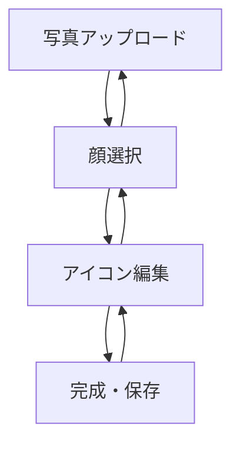

# Face Icon Maker 画面遷移設計

## 1. 画面一覧

| ID | 画面名 | 概要 |
|----|--------|------|
| S01 | トップ画面 | 写真アップロード |
| S02 | 顔選択画面 | 顔検出結果表示・顔選択 |
| S03 | アイコン編集画面 | クロップ調整・形状選択 |
| S04 | 完成画面 | アイコン確認・保存 |

---

## 2. 画面遷移図



---

## 3. 画面詳細

### S01 写真アップロード

#### 目的
集合写真を選択する。

#### UI要素

- アプリタイトル
- 説明文
- 写真選択ボタン
- ドラッグ＆ドロップ領域（PC）
- サンプル画像利用（将来）

#### 操作

1. 写真選択
2. 顔検出開始
3. 顔選択画面へ遷移

---

### S02 顔選択画面

#### 目的
検出された顔から対象人物を選択する。

#### UI要素

- 元画像表示
- 顔検出枠表示
- 検出人数表示
- 再検出ボタン
- 戻るボタン

#### 操作

1. 顔枠タップ
2. 選択状態ハイライト
3. アイコン編集画面へ遷移

#### MVPの中核価値

ユーザーは集合写真から自分を探して選ぶだけでよい。

---

### S03 アイコン編集画面

#### 目的
アイコン生成前の最終調整を行う。

#### UI要素

- クロップエリア
- プレビュー
- 拡大縮小
- 移動
- 正方形ボタン
- 円形ボタン
- 決定ボタン
- 戻るボタン

#### 初期状態

- 顔中心へ自動配置
- 1:1比率固定
- 顔周辺に適切な余白を設定

#### 操作

1. 位置調整
2. サイズ調整
3. 形状選択
4. 完成画面へ

---

### S04 完成画面

#### 目的
生成結果の確認と保存。

#### UI要素

- 完成アイコン
- PNG保存ボタン
- 編集へ戻るボタン
- 最初からやり直すボタン

#### 操作

1. PNG保存
2. 再編集
3. 新規作成

---

## 4. ユーザーフロー

### 正常系

1. 写真アップロード
2. 顔検出
3. 顔選択
4. 自動クロップ
5. 微調整
6. PNG保存

想定完了時間：30秒以内

---

## 5. エラー系

### 顔未検出

表示メッセージ

```text
顔を検出できませんでした。
別の画像を選択してください。
```

### 顔が多すぎる

表示メッセージ

```text
顔が多数検出されました。
対象者を選択してください。
```

### 画像形式不正

表示メッセージ

```text
JPEGまたはPNG画像を選択してください。
```

---

## 6. 将来拡張

### Phase2

- 背景透過
- 背景色変更
- グラデーション背景
- ドット絵変換
- イラスト風変換

### Phase3

- SNS共有
- アイコンテンプレート
- 複数人一括生成
- PWA対応

---

## 7. UX方針

ユーザーに画像編集をさせるのではなく、顔選択だけでアイコンが完成する体験を目指す。

理想フロー

写真を選ぶ → 自分をタップ → 保存
